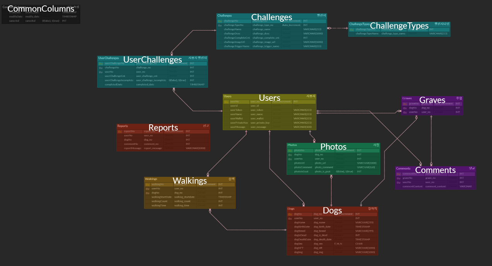
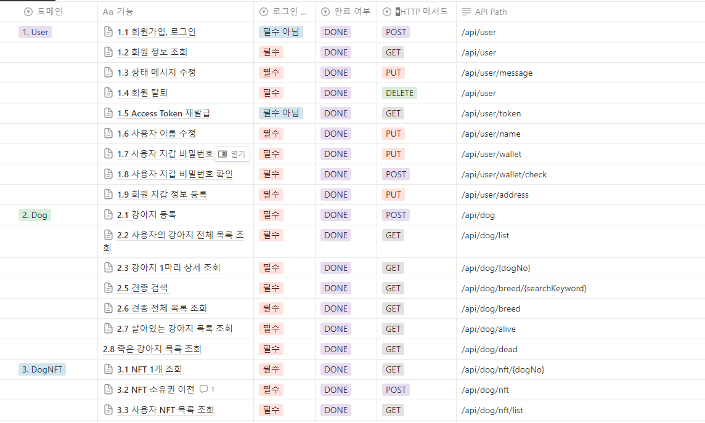
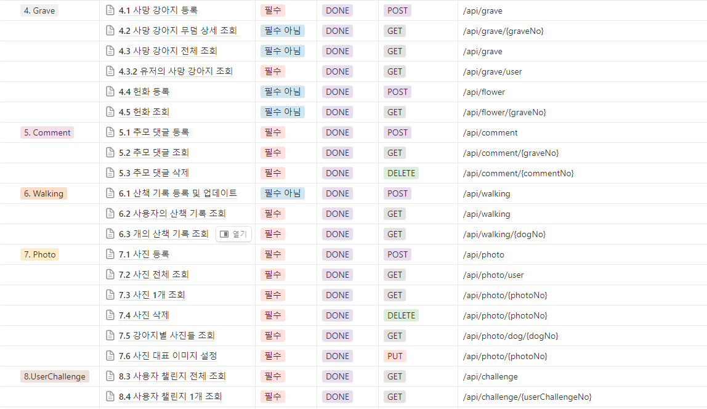
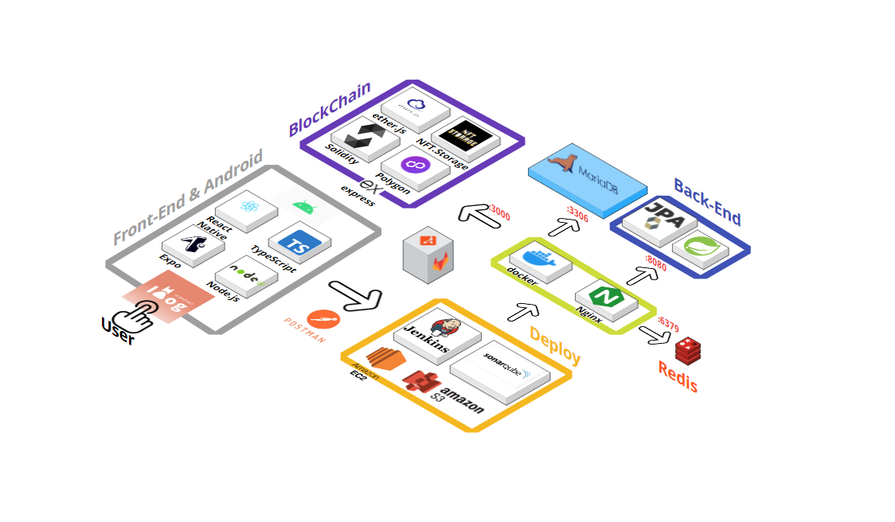

# IDog

  

## 💌 프로젝트 개요

2023.08.21 ~ 2023.10.06(7주)

### 기획 배경

강아지 공장을 통해 강아지를 사고파는 행위가 지속되고, 무분별한 파양을 막기 위해 IDog 서비스를 기획
 

### IDog 서비스는

**강아지의 상품화를 억제**하고 강아지의 정보를 NFT화하여 강아지 프로필을 만들어 반려견을 가진 사람들을 위한 **커뮤니티를 제공**합니다.  
NFT의 데이터가 영원히 저장되는 특성을 이용하여 견주와 반려견의 **추억을 영원히 기록**할 수 있는 공간 제공합니다.

 

## :heart: 역할

|        | Part      | Detail                                                                                              |
| ------ | --------- | --------------------------------------------------------------------------------------------------- |
| 김민섭 | Front-End | -                                                                                                   |
| 나건   | Back-End  | -                                                                                                   |
| 윤선희 | Back-End  | 팀장   [Back] Dog 관련 api   [BlockChain] 디지털 지갑 구현, 스마트컨트랙트 작성, NFT 민팅 구현 |                                                                                                
| 이가경 | Back-End  | [Back] 소셜로그인   [Infra] 인프라 구축 및 CI/CD   [BlockChain] 디지털 지갑 구현, IPFS 업로드 |
| 이성섭 | Front-End | -                                                                                                   |
| 최찬영 | Front-End | -                                                                                                   |

 

## 🕹️ 기술 스택

## 🔎 서비스 소개

**반려동물 양육 가구 552만**인 오늘날, 반려인들에게 **특별한 추억**을 남겨주는 서비스 **“IDog”**

### 회원 관리

**[로그인]**  

   

- <b>구글 로그인</b> 기능을 통해 간편하게 서비스를 이용할 수 있습니다.

 

**[디지털 지갑 생성]**  

   

- NFT를 소유하기 위해, 디지털 지갑을 생성합니다.
- 지갑에 접근하기 위한 비밀번호를 입력하면 생성 가능합니다.
   

### 강아지 관리

**[반려견 NFT 발급]**  

   

- 반려견의 정보를 입력하여 NFT를 발급받을 수 있습니다.
   

**[등록한 반려견 상세보기]**  

   

- 등록한 반려견의 정보를 확인할 수 있습니다.
   

### 산책

**[산책 기록]**  

   

- 등록된 반려견을 선택하고, 산책 시작 버튼을 통해 기록 할 수 있습니다.
- 위젯을 이용하여 홈 화면에서 바로 기록 가능합니다.
   

### 포토앨범

**[사진 등록]** 

   

- 반려견의 귀여운 모습을 남길 수 있습니다.
   

### 하늘공원

> 무지개 다리를 건넌 반려견을 추모하기 위한 공간

**[하늘공원 둘러보기]**  

   

- 다른 사용자들이 등록한 반려견의 추모 공간을 확인 할 수 있습니다.
- 추모하기, 헌화 기능을 통해 반려견을 기릴 수 있습니다.
- 댓글 작성을 통해 반려견을 기릴 수 있습니다.
   

**[하늘공원에 반려견 등록하기]**  

   

- 무지개 다리를 건넌 반려견을 추모 공간에 등록할 수 있습니다.
   

**[하늘공원에 등록한 반려견 확인]**  

   

- 하늘공원에 등록한 반려견의 추모공간에 빠르게 이동할 수 있습니다.
   

## :memo: 사용자 가이드

[바로가기](./exec/Scenario.pdf)

## 📋 프로젝트 산출물

### DB ERD

  

### 기능 명세서

  
  

### API 명세서

  
  

### 아키텍쳐 다이어그램

  

## 📽️ UCC

[바로가기](https://youtu.be/XmY9bs3zNic?si=GDPcchyJBiYnnfxA)

 

## 💎 느낀 점(소감)

### 🐶김민섭🐶

### 🐶나건🐶

### 🐶윤선희🐶
블록체인 기술을 활용해 볼 수 있는 좋은 기회였습니다. Solidity, RemixIDE, 스마트컨트랙트, openzeppeline 등 블록체인 관련 언어 및 기술들에 대해서 학습할 수 있었습니다.  
블록체인 기술을 적용하면서 back-end개발자이지만 front-end를 학습하고 활용할 수 있어 개발 경험을 확장 시킬 수 있어서 재밌는 프로젝트 기간이었습니다.  
또한 Dog 도메인을 기준으로 여러 도메인에 연관관계를 맺으며 JPA를 활용할 수 있었습니다.  
블록체인과 ReactNative 기반의 앱 개발을 동시에 진행한다는 점이 처음에는 어렵게 느껴졌지만, 결과적으로는 프로젝트를 완성하고 좋은 성과를 이룰 수 있어서 기억에 남는 프로젝트가 되었습니다.  
7주간 함께 해준 팀원들에게 고생했고 함께해서 감사했다는 말 전하고 싶습니다~!!  

### 🐶이가경🐶

블록체인에 대해서 개념만 알고 있었는데, 이번 프로젝트를 통해서 어떻게 동작하고 어떤 장점들이 있는지를 알 수 있어서 좋았습니다.
 
Coov를 통해서 NFT가 대상을 식별 가능한 정보가 될 수 있다는 인사이트를 얻을 수 있었는데, 이 부분에서 블록체인 도메인이 정말 흥미롭고 확장성이 넓다는 것을 알 수 있어서 재밌었습니다.
 
개발하면서 블록체인을 붙이는 과정이 어렵긴 했지만, 문제를 해결해나가는 과정들은 재밌었고 결국엔 완성시킬 수 있었어서 뿌듯했습니다. 😊
 

### 🐶이성섭🐶

### 🐶최찬영🐶
